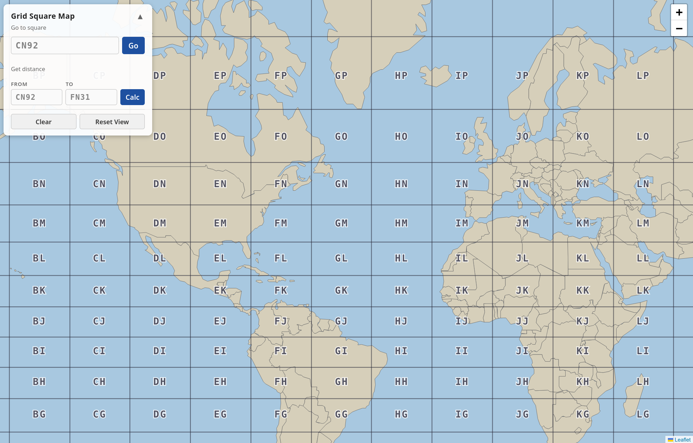
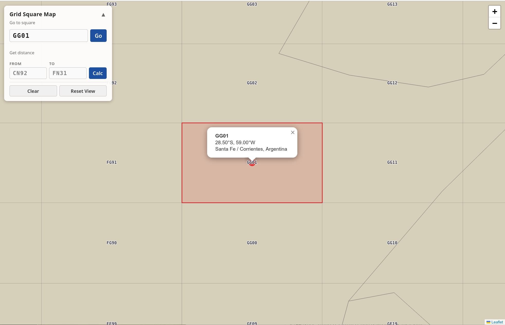
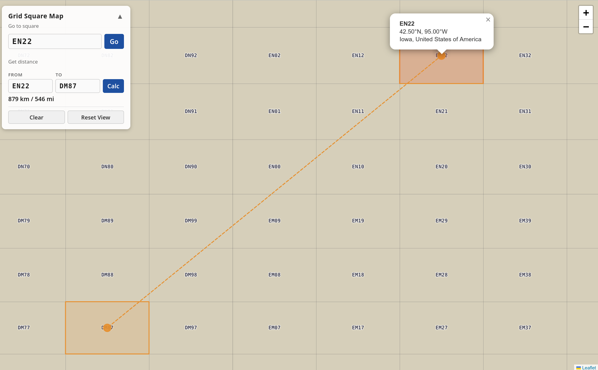

# Grid Square Map

An offline, self-hostable Maidenhead grid square map. Look up any grid square (e.g. `FN92`, `IO91`, `CN92`) on a world map, see its coordinates and location, and calculate the distance between two squares.

## Features

- World map with Maidenhead grid overlay (field labels at world zoom, 4-char square labels when zoomed in)
- Search for a grid square by name — pans to it and shows coordinates, country, and state/province
- Click any visible square on the map to select it
- Distance calculator between two grid squares — shows km/mi and draws a line on the map
- Fully offline after initial setup — no tile server, no external APIs
- Works in any modern browser

## Screenshots
- Main UI


- Search for a grid square and see its location:


- Calculate distance:


---

## Running Without Docker

### 1. Clone the repo

```bash
git clone https://github.com/hestela/grid-square-map.git
cd grid-square-map
```

### 2. Download assets

Run the setup script once to download Leaflet and the map data files:

```bash
bash setup.sh
```

This downloads:
- Leaflet 1.9.4 (JS + CSS + marker images)
- Natural Earth 110m countries GeoJSON (~839 KB) — base map
- Natural Earth 10m states/provinces GeoJSON (~39 MB) — country/state lookup

Requires `curl` and `bash`.

### 3. Serve the app

Any static file server works. The simplest option:

```bash
python3 -m http.server 3456
```

Then open [http://localhost:3456](http://localhost:3456).

Other options:
```bash
# Node.js (npx, no install required)
npx serve .

# PHP
php -S localhost:3456
```

> **Note:** The app must be served over HTTP — opening `index.html` directly via `file://` will not work because the browser blocks `fetch()` requests for local files.

---

## Running With Docker

The Docker image downloads all assets at build time so no setup script is needed.

### Pull from GitHub Container Registry

```bash
docker pull ghcr.io/hestela/grid-square-map:latest
docker run -p 3456:80 ghcr.io/hestela/grid-square-map:latest
```

Then open [http://localhost:3456](http://localhost:3456).

### Build locally

```bash
docker build -t grid-square-map .
docker run -p 3456:80 grid-square-map
```

### Trigger a new image build

The Docker image is built and pushed to the GitHub Container Registry on demand via GitHub Actions.

To trigger a build: go to the [Actions tab](https://github.com/hestela/grid-square-map/actions) → **Build and Push Docker Image** → **Run workflow**.

---

## Maidenhead Grid System

Grid squares use the [Maidenhead Locator System](https://en.wikipedia.org/wiki/Maidenhead_Locator_System) used in amateur radio:

| Length | Example | Coverage |
|--------|---------|----------|
| 2 chars (field) | `CN` | 20° × 10° |
| 4 chars (square) | `CN92` | 2° × 1° |

This app supports both 2-char and 4-char locators.

---

## Data Sources

- [Natural Earth](https://www.naturalearthdata.com/) — country and state/province boundaries (public domain)
- [Leaflet](https://leafletjs.com/) — map library (BSD 2-Clause)
